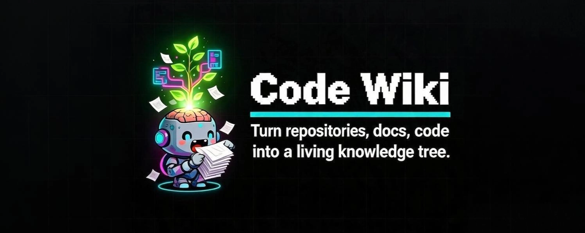

# CodeWiki

<p align="center">
  
</p>

<p align="center">
  <b>English</b> | <a href="README_zh.md">中文</a>
</p>

AI-powered code knowledge base generator. Transform any source code repository into a structured, searchable wiki maintained by your AI coding assistant.

## Inspiration

- [Andrej Karpathy's LLM Wiki pattern](https://gist.github.com/karpathy/442a6bf555914893e9891c11519de94f) — the idea of compiling knowledge once into interconnected markdown files and keeping them current with LLMs.
- [obsidian-wiki](https://github.com/Ar9av/obsidian-wiki) — architecture adapted from this skill-based framework for AI-maintained knowledge bases.

## Three-Layer Architecture

```
┌─────────────────────────────────────────────────────┐
│  Layer 3: Schema (this repo)                        │
│  Rules, templates, skills — tells the LLM HOW      │
├─────────────────────────────────────────────────────┤
│  Layer 2: Wiki (LLM-maintained)                     │
│  Compiled knowledge — synthesized, cross-referenced │
├─────────────────────────────────────────────────────┤
│  Layer 1: Raw Sources (your code repo)              │
│  Source of truth — never modified by the wiki       │
└─────────────────────────────────────────────────────┘
```

| Layer | Role | Who maintains |
|---|---|---|
| **Raw Sources** | Your source code — `.ts`, `.py`, `.go`, `.java`, `.rs`, configs, tests | You (the developer) |
| **Wiki** | Compiled knowledge — architecture, modules, flows, decisions | The LLM (via skills) |
| **Schema** | Rules governing wiki structure — categories, templates, conventions | This repo |

The wiki is a **read-optimized projection** of the codebase. It trades write-time compute (LLM analysis) for read-time speed (instant answers from pre-compiled pages).

## Wiki Layer Structure

The default wiki structure is defined in [`schema/wiki-structure.yaml`](schema/wiki-structure.yaml):

| Directory | Label | Purpose |
|---|---|---|
| `01-overview/` | Project Overview | What this repo is — background, tech stack, entry points |
| `02-architecture/` | Architecture | How the code is organized — layers, components, boundaries |
| `03-modules/` | Modules | What each module does — responsibilities, key files, APIs |
| `04-flows/` | Flows | How features work end-to-end — call chains, data flow |
| `05-config/` | Configuration | What each config does — env vars, defaults, impacts |
| `06-testing/` | Testing | How to test — strategy, structure, coverage |
| `07-ops/` | Troubleshooting | What to do when things break — errors, debugging, fixes |
| `08-decisions/` | Decision Records | Why things are the way they are — ADRs, tradeoffs |

## Install

```bash
npx skills add xiaoxiang/CodeWiki
```

Or clone manually:

```bash
git clone https://github.com/xiaoxiang/CodeWiki.git ~/CodeWiki
cd ~/CodeWiki
./install.sh
```

`install.sh` creates `.env`, writes global config to `~/.code-wiki/config`, and symlinks skills into all supported AI agents.

## Usage Guide

Once installed, you can invoke the corresponding skills via slash commands from any code repository. They are introduced below in the order you would typically use them.

### Step 1: Generate the Wiki — `/code-wiki-ingest`

After installation, open your target repository in your AI assistant (Claude Code, Cursor, Windsurf, etc.) and **type the slash command in the assistant's chat**, not in the terminal:

```text
# In the AI assistant chat window (NOT the shell):
/code-wiki-ingest
```

> The terminal is only used to `cd` into your project (or open it in your editor). All `/code-wiki-*` commands are invoked inside the LLM chat — the AI assistant reads the corresponding skill file from `.skills/` and executes it.

This skill performs the following work:

- **Scans the repo structure**: walks the source tree, reads the README, and parses package metadata and git history.
- **Resolves module boundaries**: identifies module divisions, dependency graph, and entry points.
- **Extracts architecture, APIs, and design patterns**: distills system layering, interface contracts, and idiomatic patterns from the code.
- **Generates interconnected documentation pages**: produces markdown pages (with frontmatter) under the eight categories defined in `schema/wiki-structure.yaml` (Project Overview, Architecture, Modules, Flows, Configuration, Testing, Troubleshooting, Decision Records), wired together via `[[wikilinks]]`.
- **Maintains metadata**: writes `.manifest.json` and updates `index.md` and `log.md`. On subsequent runs it only processes the git delta — no redundant regeneration.

### Day-to-Day Usage: When to Use the Other Skills

#### `/code-wiki-query` — Query information from the Wiki

Use this when you want to know "what does X do", "how does Y work", or "where is Z implemented". It first scans page titles, tags, and the `summary` field in frontmatter (fast-index mode), and only opens page bodies for deeper search when the index pass cannot answer. The final response is a synthesized answer with `[[wikilink]]` citations.

```text
# In the AI assistant chat:
/code-wiki-query How is the user login flow implemented?
```

#### `/code-wiki-lint` — Audit Wiki health

Use this to run a health check on the generated wiki. It looks for the following issues and suggests fixes:

- Broken or stale `[[wikilinks]]`
- Orphan pages that no other page references
- Outdated content that has drifted from the source code
- Missing or non-conforming frontmatter (`title`, `category`, `tags`, `sources`, `created`, `updated`)

```text
# In the AI assistant chat:
/code-wiki-lint
```

#### `/code-wiki-rebuild` — Archive and rebuild the Wiki

Use this when the wiki has drifted too far from the code, when incremental updates can no longer fix it, or when you want to restore a previous snapshot. It supports archiving the current wiki, rebuilding from scratch, and restoring earlier snapshot versions.

```text
# In the AI assistant chat:
/code-wiki-rebuild
```

## Create Your First Wiki

Setup done. Now open any code repository in your AI assistant (Claude Code, Cursor, Windsurf, Gemini CLI, etc.) and invoke the ingest skill **from inside the assistant's chat** — not from the shell.

1. **In your terminal**, navigate to the project (or open it in your editor):

   ```bash
   cd /path/to/your/project
   ```

2. **In the AI assistant's chat window**, type:

   ```text
   /code-wiki-ingest

   # Or specify a path explicitly:
   /code-wiki-ingest /path/to/your/project
   ```

   The assistant will load the `code-wiki-ingest` skill from `.skills/` and execute it for you.

The first ingest automatically creates the `./wiki/` directory structure and generates a complete knowledge base for your codebase. Subsequent runs compute the git delta and only process what changed.

> **Note:** `/code-wiki-*` are *skill commands*, not shell commands. Running them in bash will fail with "command not found". They must be sent as messages to your LLM-based coding assistant.

## Skills

Everything lives in `.skills/`. Each skill is a markdown file the agent reads when triggered:

| Skill | What it does | Trigger |
|---|---|---|
| `code-wiki-ingest` | Analyze source code and generate wiki pages | `/code-wiki-ingest` |
| `code-wiki-query` | Answer questions from the compiled wiki | `/code-wiki-query` |
| `code-wiki-lint` | Find broken links, orphans, stale content | `/code-wiki-lint` |
| `code-wiki-rebuild` | Archive, rebuild from scratch, or restore | `/code-wiki-rebuild` |

> Slash commands (`/skill-name`) work in Claude Code, Cursor, Windsurf, and most modern AI agents. In other tools, describe what you want and the agent will find the right skill.

## Supported AI Platforms

Works with **any AI coding agent** that can read files. `install.sh` handles skill discovery for each one automatically.

| Platform | Bootstrap File | Skills Directory |
|---|---|---|
| **Claude Code** | `CLAUDE.md` | `.cursor/skills/` (local) |
| **Cursor** | `.cursor/rules/code-wiki.mdc` | `.cursor/skills/` |
| **Windsurf** | `.windsurf/rules/code-wiki.md` | `.windsurf/skills/` |
| **Gemini CLI** | `GEMINI.md` | `~/.gemini/skills/` |
| **Google Antigravity** | `.agent/rules/` + `.agent/workflows/` | `.agents/skills/` |
| **Codex (OpenAI)** | `AGENTS.md` | `~/.codex/skills/` |
| **Kiro** | `.kiro/steering/code-wiki.md` | `.kiro/skills/` + `~/.kiro/skills/` |
| **Hermes** | `AGENTS.md` | `~/.hermes/skills/` |
| **OpenClaw** | `AGENTS.md` | `~/.openclaw/skills/` |
| **OpenCode** | `AGENTS.md` | `~/.agents/skills/` |
| **Aider** | `AGENTS.md` | `~/.agents/skills/` |
| **Factory Droid** | `AGENTS.md` | `~/.agents/skills/` |
| **Trae / Trae CN** | `AGENTS.md` | `~/.trae/skills/` |
| **Pi** | `AGENTS.md` | `~/.pi/agent/skills/` |
| **Kilocode** | `AGENTS.md` / `CLAUDE.md` | `.agents/skills/` |
| **GitHub Copilot** | `.github/copilot-instructions.md` | `~/.copilot/skills/` |
| **Qoder** | `AGENTS.md` | `~/.qoder/skills/` |

## Configuration

Copy `.env.example` to `.env` and customize:

```bash
cp .env.example .env
```

Key variables:

| Variable | Purpose | Default |
|---|---|---|
| `CODE_WIKI_OUTPUT_PATH` | Where the wiki lives (relative to code repo) | `./wiki` |
| `CODE_WIKI_LINK_FORMAT` | Link style: `wikilink` or `markdown` | `wikilink` |
| `CODE_WIKI_MAX_PAGES_PER_INGEST` | Max pages updated per ingest | `20` |
| `LINT_SCHEDULE` | Wiki health check frequency | `manual` |

See [`.env.example`](.env.example) for the full list.

## QMD Semantic Search (Optional)

By default, skills use Grep/Glob for search — fully functional, no extra setup. For large codebases or concept-level matching, plug in [QMD](https://github.com/tobi/qmd):

```bash
# Index your wiki and source code
qmd index --name wiki /path/to/wiki
qmd index --name code /path/to/source
```

Then set in `.env`:

```env
QMD_WIKI_COLLECTION=wiki
QMD_CODE_COLLECTION=code
QMD_TRANSPORT=mcp    # mcp | cli
```

**What changes with QMD:**
- `code-wiki-query` runs semantic search before grep — finds conceptually related pages even without exact term matches
- `code-wiki-ingest` queries indexed code before writing — surfaces related modules, detects overlaps

Both skills degrade gracefully without QMD configured.

## Project Structure

```
CodeWiki/
├── .skills/                        # Canonical skill definitions (source of truth)
│   ├── code-wiki/SKILL.md          # Core pattern — three-layer architecture
│   ├── code-wiki-ingest/SKILL.md   # Analyze code → generate wiki
│   ├── code-wiki-query/SKILL.md    # Query the wiki
│   ├── code-wiki-lint/SKILL.md     # Audit wiki health
│   └── code-wiki-rebuild/SKILL.md  # Archive/rebuild/restore
│
├── schema/
│   └── wiki-structure.yaml         # Configurable wiki directory layout
│
├── CLAUDE.md                       # Bootstrap → Claude Code / Kilocode
├── GEMINI.md                       # Bootstrap → Gemini CLI / Antigravity
├── AGENTS.md                       # Bootstrap → Codex, OpenCode, Aider, Droid, Trae, Hermes, Pi
├── .cursor/rules/code-wiki.mdc     # Always-on → Cursor
├── .windsurf/rules/code-wiki.md    # Always-on → Windsurf
├── .kiro/steering/code-wiki.md     # Always-on → Kiro
├── .github/copilot-instructions.md # Always-on → GitHub Copilot (VS Code)
│
├── install.sh                       # One-command agent install
├── uninstall.sh                    # Remove all symlinks and config
├── .env.example                    # Configuration template
└── README.md                       # You are here
```

## Customizing Wiki Structure

The default 8-directory structure is defined in `schema/wiki-structure.yaml`. You can customize:

- Add or remove category directories
- Modify the `sections` list for each category
- Change labels and descriptions
- Create project-specific structures

After modification, the next ingest will generate pages following the new structure.

See [`schema/wiki-structure.yaml`](schema/wiki-structure.yaml) for the full schema definition.
